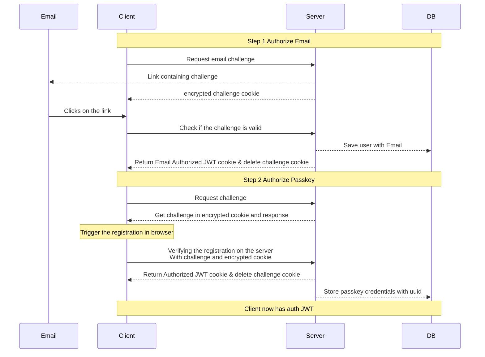
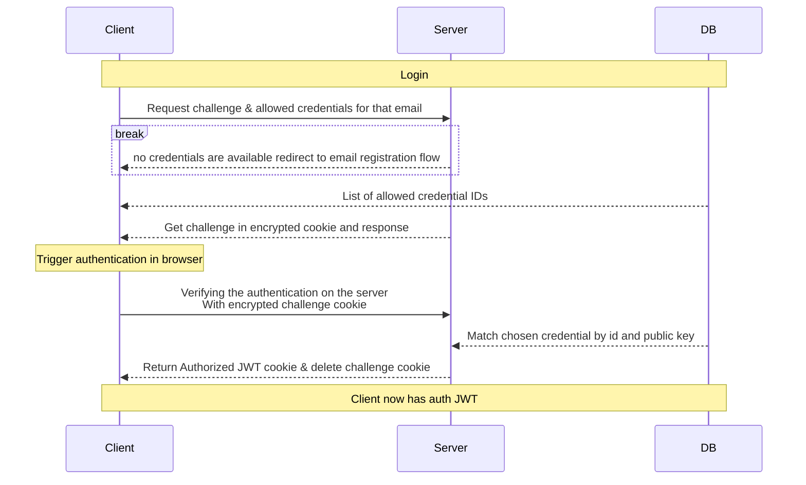
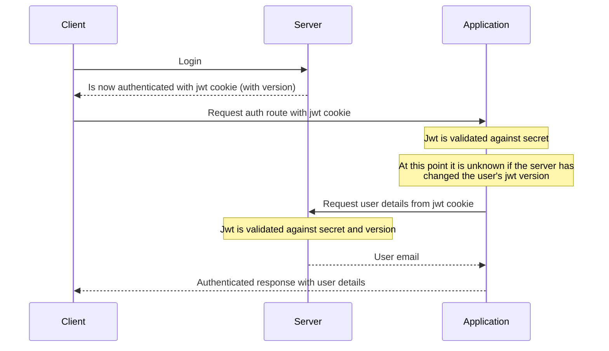

# Stupid Webauthn Server

## Docker

```
docker pull lil5/stupidwebauthn-server:latest
```

## Manual Installation

To install dependencies:

```sh
bun install
```

Copy email template & environment file and configure:

```sh
cp email-example.html data/email.html
cp env-example .env
vim .env
```

To run:

```sh
bun run dev
```

open http://localhost:5178/

## Links

```
https://webauthn.passwordless.id/
https://hono.dev/docs/helpers/jwt
https://hono.dev/docs/helpers/cookie
https://bun.sh/docs/api/sqlite
```

## Flows

### Register



### Login



### Application middleware


